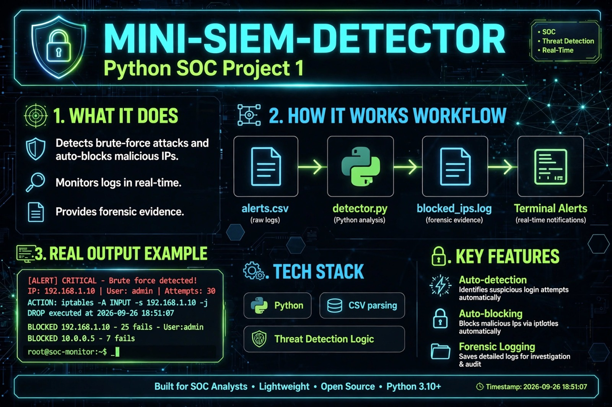

# MINI-SIEM-DETECTOR 🛡️
Python-based SOC Mini-SIEM that detects brute-force attacks & auto-blocks IPs

## 🚨 What it does
Detects 5+ failed logins and blocks attacker IP automatically

## ⚙️ How it works
alerts.csv -> detector.py -> blocked_ips.log + Terminal Alerts

## 📸 Real Proof
[ALERT] CRITICAL - Brute force detected!
IP: 192.168.1.10 | User: admin | Attempts: 30
ACTION: iptables -A INPUT -s 192.168.1.10 -j DROP
Timestamp: 2026-09-26 18:51:07

## 📂 Files
- detector.py - Detection logic
- alerts.csv - Sample logs  
- blocked_ips.log - Forensic evidence

Built by Mounika Sarumpudi | Aspiring SOC Analyst
